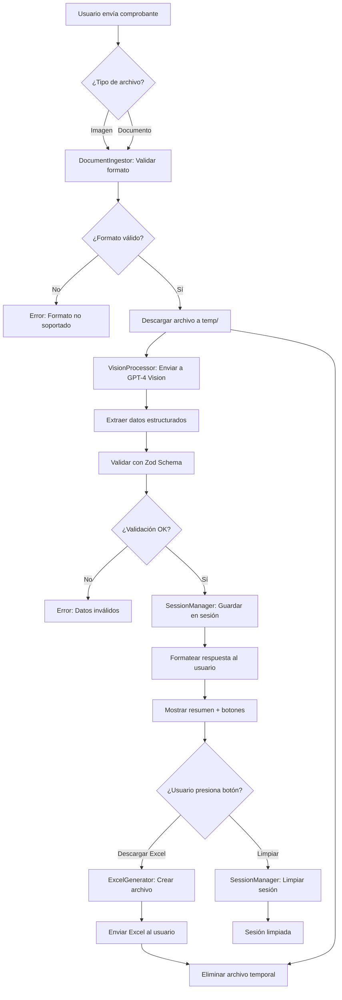

# 🤖 Bot de Procesamiento de Comprobantes

Bot de Telegram con IA que extrae datos estructurados de facturas y comprobantes usando GPT-4 Vision.

## 📋 Tabla de Contenidos

- [Características](#-características)
- [Instalación y Configuración](#-instalación-y-configuración)
- [Workflow](#-workflow)
- [Comandos](#-comandos)
- [Estructura del Proyecto](#-estructura-del-proyecto)
- [Datos Extraídos](#-datos-extraídos)
- [Formatos Soportados](#-formatos-soportados)
- [Costos](#-costos)
- [Seguridad](#-seguridad)
- [Troubleshooting](#-troubleshooting)
- [Documentación](#-documentación)
- [Roadmap](#-roadmap)

---

## ✨ Características

- 📸 **Procesamiento automático** de múltiples formatos de archivo
- 🖼️ **Imágenes:** JPG, PNG, GIF, WEBP, BMP, TIFF (fotos, screenshots)
- 📄 **Documentos:** PDF, DOCX, DOC, XLSX, XLS, PPTX, PPT
- 🧠 **GPT-4 Vision** para extracción inteligente de datos
- ✅ **Validación** con Zod schemas
- 📊 **Generación de Excel** profesionales con formato
- 📦 **Acumulación de facturas** en sesiones de usuario
- 🔽 **Botones interactivos** para descargar Excel
- 🔐 **Eliminación automática** de archivos temporales
- 🌍 **Multi-moneda** (ARS, USD, EUR, BRL, CLP, MXN, COP)
- 🛡️ **Seguridad avanzada**: Autenticación, rate limiting y audit logging

---

## 🚀 Instalación y Configuración

### Requisitos Previos

- Node.js 18+ y npm
- Token de bot de Telegram ([@BotFather](https://t.me/botfather))
- API Key de OpenAI ([platform.openai.com](https://platform.openai.com/))

### Pasos de Instalación

1. **Clonar e instalar dependencias:**
   ```bash
   npm install
   ```

2. **Configurar variables de entorno:**
   Crear archivo `.env` en la raíz del proyecto:
   ```env
   # Configuración básica
   TELEGRAM_BOT_TOKEN=tu_token_aqui
   OPENAI_API_KEY=tu_api_key_aqui
   OPENAI_MODEL=gpt-4o-mini
   IMAGE_RETENTION_HOURS=0
   NODE_ENV=development
   
   # Seguridad (Opcional)
   # Autenticación: Lista de IDs de usuarios autorizados (separados por comas)
   # Si no se configura, el bot está en modo abierto (todos los usuarios permitidos)
   ALLOWED_USER_IDS=123456789,987654321
   
   # Rate Limiting: Límites de peticiones por usuario
   RATE_LIMIT_REQUESTS_PER_MINUTE=10
   RATE_LIMIT_REQUESTS_PER_HOUR=50
   
   # Audit Logging: Habilitar logging inmutable en archivos
   USE_FILE_AUDIT_LOG=false
   AUDIT_LOG_DIR=./logs/audit
   AUDIT_LOG_MAX_SIZE_MB=100
   ```

3. **Compilar TypeScript:**
   ```bash
   npm run build
   ```

4. **Ejecutar en desarrollo:**
   ```bash
   npm run dev
   ```

---

## 🔄 Workflow

### Diagrama de Flujo del Sistema



### Flujo de Usuario

```
┌─────────────────────────────────────────────────────────────┐
│                    FLUJO DE USUARIO                         │
└─────────────────────────────────────────────────────────────┘

1. Usuario envía /start
   └─> Bot responde con mensaje de bienvenida

2. Usuario envía foto/documento de comprobante
   ├─> Bot valida formato (magic bytes)
   ├─> Descarga archivo temporalmente
   ├─> Envía a GPT-4 Vision para procesamiento
   ├─> Extrae datos estructurados
   ├─> Valida con Zod schema
   └─> Guarda en sesión del usuario

3. Bot responde con:
   ├─> Resumen formateado de la factura
   ├─> Botón "Descargar Excel"
   └─> Botón "Limpiar Sesión"

4. Usuario puede:
   ├─> Enviar más comprobantes (acumulación)
   ├─> Presionar "Descargar Excel" → Recibe archivo Excel
   ├─> Presionar "Limpiar Sesión" → Elimina todas las facturas
   └─> Usar /facturas → Ver lista de facturas acumuladas

5. Archivos temporales se eliminan automáticamente
```

### Estados de Sesión

```
┌──────────────┐
│   VACÍA      │ ← Sesión inicial o después de /limpiar
└──────┬───────┘
       │
       │ Usuario envía comprobante
       ▼
┌──────────────┐
│  ACTIVA      │ ← Contiene 1+ facturas
└──────┬───────┘
       │
       ├─> Usuario envía más comprobantes → Se acumulan
       ├─> Usuario presiona "Descargar Excel" → Genera archivo
       ├─> Usuario presiona "Limpiar" → Vuelve a VACÍA
       └─> Timeout 30min sin actividad → Vuelve a VACÍA
```

---

## ⌨️ Comandos

### Comandos Disponibles

| Comando | Descripción | Ejemplo |
|---------|-------------|---------|
| `/start` | Mensaje de bienvenida e instrucciones iniciales | `/start` |
| `/help` | Muestra ayuda detallada sobre el uso del bot | `/help` |
| `/stats` | Muestra estadísticas del sistema (usuarios activos, facturas procesadas) | `/stats` |
| `/facturas` | Lista todas las facturas acumuladas en tu sesión actual | `/facturas` |
| `/limpiar` | Elimina todas las facturas de tu sesión actual | `/limpiar` |

### Uso de Comandos

**Iniciar sesión:**
```
Usuario: /start
Bot: 👋 ¡Hola! Soy tu asistente para procesar comprobantes...
```

**Ver facturas acumuladas:**
```
Usuario: /facturas
Bot: 📊 Tienes 3 facturas en tu sesión:
     1. Factura #12345 - $15,000 ARS
     2. Factura #12346 - $8,500 ARS
     3. Factura #12347 - $22,300 ARS
```

**Limpiar sesión:**
```
Usuario: /limpiar
Bot: ✅ Sesión limpiada. Se eliminaron 3 facturas.
```

### Interacciones con Botones

El bot incluye botones interactivos que aparecen después de procesar un comprobante:

- **📥 Descargar Excel**: Genera y envía un archivo Excel con todas las facturas acumuladas
- **🗑️ Limpiar Sesión**: Elimina todas las facturas de la sesión actual

---

## 📁 Estructura del Proyecto

```
IA Telegram Bot/
├── src/
│   ├── index.ts                    # 🚀 Punto de entrada principal
│   └── modules/
│       ├── DataStructures.ts       # 📝 Formateo y logging (helpers)
│       ├── DocumentIngestor.ts     # 📥 Gestión de archivos (descarga, validación)
│       ├── ExcelGenerator.ts       # 📊 Generador de Excel (formato profesional)
│       ├── Interfaces.ts           # 🔧 Schemas Zod + TypeScript Types
│       ├── SessionManager.ts       # 💾 Gestión de sesiones (acumulación de facturas)
│       ├── TelegramBot.ts          # 🤖 Bot de Telegram (comandos, handlers, callbacks)
│       └── VisionProcessor.ts      # 👁️ GPT-4 Vision (procesamiento de imágenes/docs)
├── temp/                           # 📁 Almacenamiento temporal de archivos
├── dist/                           # 📦 Compilado de TypeScript
├── node_modules/                   # 📚 Dependencias
├── .env                            # 🔐 Variables de entorno (NO INCLUIR EN GIT)
├── .gitignore                      # 🚫 Archivos ignorados por Git
├── package.json                    # 📋 Configuración de dependencias
├── tsconfig.json                   # ⚙️ Configuración de TypeScript
├── README.md                       # 📖 Documentación principal
├── Structure.md                    # 🏗️ Arquitectura detallada
└── ARCHITECTURE_BRIEF.md          # 📐 Brief técnico completo
```

### 🔍 Descripción de Módulos Principales

| Módulo | Responsabilidad | Líneas |
|--------|----------------|--------|
| **DataStructures.ts** | Clases helper (InvoiceResponse, ProcessingResultFormatter, Logger), formateo de mensajes | ~313 |
| **DocumentIngestor.ts** | Descarga de archivos desde Telegram, validación por magic bytes, limpieza temporal | ~383 |
| **ExcelGenerator.ts** | Generación de archivos Excel con formato profesional (headers azules, bordes, formato moneda) | ~288 |
| **Interfaces.ts** | Schemas Zod para validación, tipos TypeScript, contratos de datos | ~140 |
| **SessionManager.ts** | Gestión de sesiones de usuario, acumulación de facturas, limpieza automática (timeout 30min) | ~176 |
| **TelegramBot.ts** | Manejo de conexión, comandos (/start, /help, /facturas), handlers de mensajes (foto, documento), callbacks de botones (descargar Excel, limpiar) | ~602 |
| **VisionProcessor.ts** | Integración con GPT-4 Vision API, prompt engineering, extracción de datos de imágenes/PDFs | ~314 |

---

## 📊 Datos Extraídos

El bot extrae los siguientes datos de los comprobantes:

### Información Principal
- **Número de factura** - Identificador único del comprobante
- **Fecha** - Fecha de emisión
- **Tipo de operación** - Tipo de comprobante (Factura A, B, C, etc.)

### Información del Proveedor
- **Nombre** - Razón social del proveedor
- **Tax ID (CUIT)** - Identificador fiscal
- **Dirección** - Dirección del proveedor

### Información Financiera
- **Monto total** - Monto total de la factura
- **Moneda** - ARS, USD, EUR, BRL, CLP, MXN, COP
- **Items** - Lista de items con:
  - Descripción
  - Cantidad
  - Precio unitario
- **Impuestos (IVA)** - Monto de impuestos aplicados
- **Método de pago** - Forma de pago utilizada

### Metadata
- **Tiempo de procesamiento** - Tiempo que tomó procesar el comprobante
- **Nivel de confianza** - Confianza en la extracción de datos

### Formato del Excel Generado

El archivo Excel generado incluye:
- **Headers con estilo profesional** (azul con texto blanco)
- **Columnas:** Fecha, Tipo Operación, CUIT, Monto Bruto, Banco Receptor
- **Bordes y formato de moneda** automático
- **Soporte para múltiples facturas** en un solo archivo

---

## 📎 Formatos Soportados

### Imágenes
- JPG, JPEG
- PNG
- GIF
- WEBP
- BMP
- TIFF

### Documentos
- PDF
- DOCX (Microsoft Word)
- DOC (Microsoft Word Legacy)

### Hojas de Cálculo
- XLSX (Microsoft Excel)
- XLS (Microsoft Excel Legacy)

### Presentaciones
- PPTX (Microsoft PowerPoint)
- PPT (Microsoft PowerPoint Legacy)

### Detección Automática

El bot detecta automáticamente el tipo de archivo mediante **análisis de magic bytes**, por lo que funciona incluso si la extensión del archivo es incorrecta o está ausente.

---

## 💰 Costos

### Modelos de OpenAI

| Modelo | Costo por Comprobante | Recomendación |
|--------|----------------------|---------------|
| **gpt-4o-mini** | ~$0.01 - $0.02 | ✅ Recomendado para uso general |
| **gpt-4o** | ~$0.03 - $0.05 | Para casos que requieren mayor precisión |

### Optimización de Costos

- Usa `gpt-4o-mini` para la mayoría de casos (suficiente para extracción de datos)
- Configura `IMAGE_RETENTION_HOURS=0` para eliminar archivos inmediatamente
- Rate limiting configurado por defecto para prevenir abusos

---

## 🛡️ Seguridad

El bot implementa medidas de seguridad esenciales para proteger la confidencialidad de la información crítica (facturas, credenciales de API) y garantizar la disponibilidad del servicio.

### 🔐 Autenticación de Usuarios

**Control de Acceso Basado en Whitelist**

El bot puede configurarse para permitir solo usuarios autorizados mediante una lista blanca (whitelist).

**Configuración:**
```env
# Lista de IDs de usuarios autorizados (separados por comas)
ALLOWED_USER_IDS=123456789,987654321,555123456
```

**Comportamiento:**
- **Modo Abierto (por defecto):** Si `ALLOWED_USER_IDS` no está configurado, todos los usuarios pueden usar el bot (útil para desarrollo)
- **Modo Whitelist:** Solo los usuarios en la lista pueden acceder al bot
- Los intentos de acceso no autorizados se registran en los logs de auditoría

**Obtener tu User ID:**
1. Envía un mensaje a [@userinfobot](https://t.me/userinfobot) en Telegram
2. El bot te responderá con tu User ID
3. Agrega ese ID a `ALLOWED_USER_IDS` en tu `.env`

---

### ⏱️ Rate Limiting

**Protección contra Abuso y DoS**

El bot implementa rate limiting para prevenir ataques de abuso y proteger los recursos del sistema.

**Configuración:**
```env
# Límites de peticiones por usuario
RATE_LIMIT_REQUESTS_PER_MINUTE=10   # Máximo 10 peticiones por minuto
RATE_LIMIT_REQUESTS_PER_HOUR=50     # Máximo 50 peticiones por hora
```

**Comportamiento:**
- Cada usuario tiene límites independientes
- Si un usuario excede el límite, recibe un mensaje informativo con el tiempo de espera
- Los límites se resetean automáticamente después del período de tiempo
- Los intentos que exceden el límite se registran en los logs de auditoría

**Valores Recomendados:**
- **Desarrollo:** 20 req/min, 100 req/hora
- **Producción:** 10 req/min, 50 req/hora
- **Alta Seguridad:** 5 req/min, 30 req/hora

---

### 📝 Audit Logging (No Repudio)

**Registro Inmutable de Acciones Sensibles**

El bot registra todas las acciones sensibles para auditoría y cumplimiento de seguridad.

**Acciones Registradas:**
- ✅ **FILE_UPLOAD_STARTED** - Cuando un usuario sube un archivo
- ✅ **FILE_PROCESSED_SUCCESS** - Archivo procesado exitosamente
- ✅ **FILE_PROCESSED_FAILED** - Error al procesar archivo
- ✅ **EXCEL_DOWNLOADED** - Cuando se descarga un archivo Excel
- ✅ **SESSION_CLEARED** - Cuando se ejecuta `/limpiar`
- ✅ **UNAUTHORIZED_ACCESS_ATTEMPT** - Intento de acceso no autorizado
- ✅ **RATE_LIMIT_EXCEEDED** - Cuando se excede el rate limit

**Configuración:**
```env
# Habilitar logging en archivos (recomendado para producción)
USE_FILE_AUDIT_LOG=true

# Directorio donde se guardan los logs
AUDIT_LOG_DIR=./logs/audit

# Tamaño máximo del archivo antes de rotar (en MB)
AUDIT_LOG_MAX_SIZE_MB=100
```

**Formato de Logs:**
Los logs se guardan en formato JSON estructurado, un evento por línea:
```json
{
  "timestamp": "2025-11-04T14:32:15.123Z",
  "action": "FILE_PROCESSED_SUCCESS",
  "userId": 123456789,
  "details": {
    "fileType": "photo",
    "invoiceNumber": "001-234",
    "totalAmount": 15750.00,
    "currency": "ARS",
    "totalInvoices": 3
  }
}
```

**Ubicación de Logs:**
- **Modo Archivo:** `./logs/audit/audit_YYYY-MM-DD.log`
- **Modo Console:** Se muestran en la consola (desarrollo)

**Rotación Automática:**
- Los logs se rotan automáticamente cuando alcanzan el tamaño máximo
- Los archivos antiguos se renombran con timestamp: `audit_2025-11-04_14-32-15.log`

---

### 🔒 Otras Medidas de Seguridad

**Validación de Archivos:**
- ✅ Validación por **magic bytes** (no confía en la extensión del archivo)
- ✅ Límites de tamaño de archivo configurable
- ✅ Whitelist de formatos soportados

**Gestión de Secretos:**
- ✅ Variables de entorno para credenciales (no hardcodeadas)
- ✅ `.env` en `.gitignore` (no se sube al repositorio)
- ✅ Secret scanning con gitleaks en CI/CD

**Eliminación de Datos:**
- ✅ Eliminación inmediata de archivos temporales (`IMAGE_RETENTION_HOURS=0`)
- ✅ Limpieza automática de sesiones expiradas
- ✅ No persistencia de datos sensibles en disco

**Aislamiento de Usuarios:**
- ✅ Sesiones completamente aisladas por usuario
- ✅ No hay fuga de datos entre usuarios
- ✅ Cada usuario solo puede acceder a sus propias facturas

---

### 📊 Checklist de Seguridad para Producción

Antes de desplegar a producción, verifica:

- [ ] `ALLOWED_USER_IDS` configurado con IDs de usuarios autorizados
- [ ] `USE_FILE_AUDIT_LOG=true` habilitado
- [ ] `AUDIT_LOG_DIR` apunta a un directorio con permisos de escritura
- [ ] `RATE_LIMIT_REQUESTS_PER_MINUTE` y `RATE_LIMIT_REQUESTS_PER_HOUR` configurados apropiadamente
- [ ] `IMAGE_RETENTION_HOURS=0` para eliminación inmediata de archivos
- [ ] Secretos configurados en el gestor de secretos de la plataforma (no en `.env`)
- [ ] Logs de auditoría siendo monitoreados regularmente
- [ ] Permisos del bot en BotFather configurados con mínimo privilegio

---

### 🚨 Respuesta a Incidentes

**Si detectas actividad sospechosa:**

1. **Revisa los logs de auditoría:**
   ```bash
   tail -f logs/audit/audit_$(date +%Y-%m-%d).log
   ```

2. **Verifica intentos de acceso no autorizados:**
   ```bash
   grep "UNAUTHORIZED_ACCESS_ATTEMPT" logs/audit/*.log
   ```

3. **Revisa excesos de rate limit:**
   ```bash
   grep "RATE_LIMIT_EXCEEDED" logs/audit/*.log
   ```

4. **Si es necesario, revoca acceso:**
   - Remueve el User ID de `ALLOWED_USER_IDS`
   - Reinicia el bot
   - Los cambios toman efecto inmediatamente

---

## 🐛 Troubleshooting

### Problemas Comunes y Soluciones

#### 🔴 Error: "OPENAI_API_KEY no definida"

**Síntomas:**
```
Error: OPENAI_API_KEY no está definida en las variables de entorno
```

**Soluciones:**
1. Verifica que el archivo `.env` existe en la raíz del proyecto
2. Confirma que contiene la línea: `OPENAI_API_KEY=tu_api_key_aqui`
3. Reinicia el bot después de modificar `.env`
4. En producción, verifica que las variables de entorno estén configuradas en la plataforma

---

#### 🔴 Error: "No se puede descargar imagen"

**Síntomas:**
```
Error al descargar el archivo desde Telegram
```

**Soluciones:**
1. Verifica que el bot tiene permisos para recibir archivos
2. Confirma que el token del bot es válido
3. Revisa la conexión a internet
4. Verifica que el archivo no exceda el tamaño máximo permitido por Telegram (20MB para fotos, 50MB para documentos)

---

#### 🔴 Error: "Formato no soportado"

**Síntomas:**
```
El formato de archivo no está soportado
```

**Soluciones:**
1. Verifica que el archivo es uno de los formatos soportados (ver sección [Formatos Soportados](#-formatos-soportados))
2. Si el archivo es una imagen, intenta convertirla a JPG o PNG
3. Si el archivo es un PDF, verifica que no esté protegido con contraseña
4. Revisa la configuración de `SUPPORTED_FORMATS` en `.env` (si existe)

---

#### 🟡 El bot no responde a comandos

**Síntomas:**
- El bot no responde a `/start` u otros comandos
- No hay respuesta después de enviar un archivo

**Soluciones:**
1. Verifica que el bot está ejecutándose (`npm run dev`)
2. Revisa los logs en la consola para errores
3. Confirma que `TELEGRAM_BOT_TOKEN` es correcto
4. Verifica que el bot no está bloqueado o deshabilitado en Telegram
5. **Si usas autenticación:** Verifica que tu User ID está en `ALLOWED_USER_IDS`
6. **Si ves "Rate limit exceeded":** Espera unos minutos antes de intentar nuevamente

---

#### 🔴 Error: "No tienes permiso para usar este bot"

**Síntomas:**
```
❌ No tienes permiso para usar este bot.
Contacta al administrador para obtener acceso.
```

**Soluciones:**
1. El bot está configurado con whitelist de usuarios
2. Obtén tu User ID enviando un mensaje a [@userinfobot](https://t.me/userinfobot)
3. Contacta al administrador para que agregue tu ID a `ALLOWED_USER_IDS`
4. El administrador debe reiniciar el bot después de agregar tu ID

---

#### 🟡 Error: "Has alcanzado el límite de peticiones"

**Síntomas:**
```
⏳ Has alcanzado el límite de peticiones.
Por favor espera X segundo(s) antes de intentar nuevamente.
```

**Soluciones:**
1. Esto es normal: el rate limiting protege el sistema contra abuso
2. Espera el tiempo indicado antes de intentar nuevamente
3. Los límites por defecto son:
   - 10 peticiones por minuto
   - 50 peticiones por hora
4. Si necesitas límites más altos, contacta al administrador

---

#### 🟡 Error: "Sesión expirada"

**Síntomas:**
```
Tu sesión ha expirado. Por favor, envía un nuevo comprobante.
```

**Soluciones:**
1. Esto es normal: las sesiones expiran después de 30 minutos de inactividad
2. Simplemente envía un nuevo comprobante para crear una nueva sesión
3. Usa `/limpiar` si quieres limpiar manualmente la sesión

---

#### 🟡 El Excel generado está vacío

**Síntomas:**
- El archivo Excel se descarga pero no contiene datos

**Soluciones:**
1. Verifica que hay facturas en tu sesión usando `/facturas`
2. Asegúrate de haber procesado al menos un comprobante antes de descargar
3. Revisa los logs para errores en la generación del Excel

---

#### 🟡 Error: "Timeout al procesar imagen"

**Síntomas:**
```
El procesamiento está tomando más tiempo del esperado
```

**Soluciones:**
1. Esto puede ocurrir con archivos muy grandes o complejos
2. Intenta con una imagen de mejor calidad o menor tamaño
3. Verifica tu conexión a internet
4. Revisa que la API de OpenAI esté funcionando correctamente

---

### Obtener Ayuda Adicional

Si el problema persiste:

1. **Revisa los logs** del bot en la consola para mensajes de error detallados
2. **Verifica la documentación** en `ARCHITECTURE_BRIEF.md` y `Structure.md`
3. **Comprueba las variables de entorno** con `console.log(process.env)`
4. **Prueba con un archivo de ejemplo** simple para aislar el problema

---

## 📚 Documentación

### Documentación Técnica

- **`ARCHITECTURE_BRIEF.md`** - Brief técnico completo del sistema
- **`Structure.md`** - Arquitectura detallada del proyecto
- **`AGENTS.md`** - Documentación sobre agentes y configuración

### Arquitectura

**Arquitectura:** Opción A (Multimodal) con GPT-4 Vision

El sistema utiliza Clean Architecture con separación en capas:
- **Domain Layer**: Entidades e interfaces
- **Application Layer**: Casos de uso
- **Infrastructure Layer**: Implementaciones (Telegram, OpenAI)
- **Presentation Layer**: Controladores y handlers

---

## 🗺️ Roadmap

### ✅ Configuración Inicial
- [x] Estructura del proyecto
- [x] Integración con Telegram Bot API
- [x] Integración con OpenAI GPT-4 Vision
- [x] Sistema de validación con Zod
- [x] Generación de archivos Excel

### 🔄 Mejoras Pendientes

#### Fase 1: Optimización
- [x] Implementar rate limiting por usuario ✅
- [ ] Optimizar prompts para reducir costos
- [x] Mejorar manejo de errores y logging ✅

#### Fase 2: Funcionalidades Avanzadas
- [ ] Implementar base de datos (PostgreSQL/MongoDB) para histórico
- [x] Agregar autenticación de usuarios ✅
- [ ] Implementar webhooks en lugar de polling
- [ ] Agregar analytics y métricas de uso

#### Fase 3: Alternativas
- [ ] Implementar OCR+LLM (Opción B) como alternativa a Vision
- [ ] Soporte para más formatos de archivo
- [ ] Procesamiento por lotes de múltiples archivos

---

## 📝 Licencia

Este proyecto es de uso privado.

---

**Desarrollado con ❤️ usando TypeScript, Node.js, Telegram Bot API y OpenAI GPT-4 Vision**
